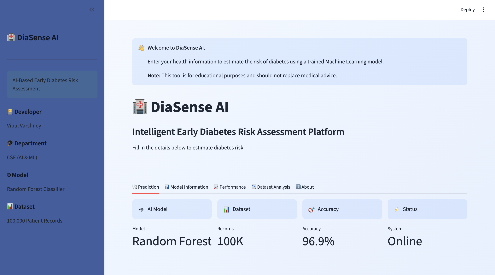
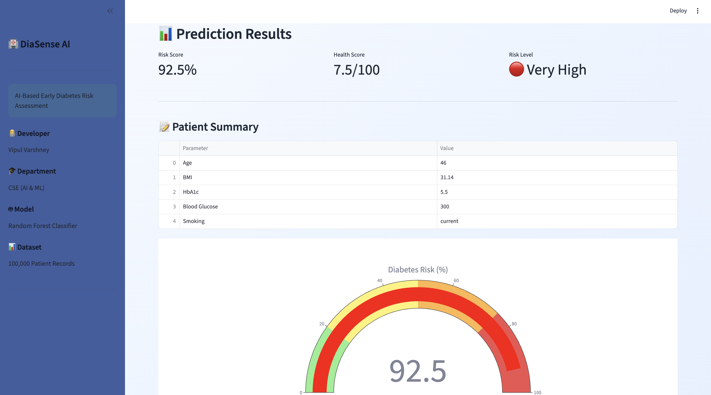

# 🏥 DiaSense AI

An AI-powered Early Diabetes Risk Prediction System built using Machine Learning and Streamlit.

---

## 📌 Overview

DiaSense AI predicts the likelihood of diabetes based on patient health parameters using a trained Random Forest Machine Learning model.

The application provides:

- 🧠 AI-based diabetes prediction
- 📊 Risk percentage
- ❤️ Health score
- 📈 Interactive risk gauge
- 💡 Personalized recommendations
- 📄 Downloadable PDF report
- 📉 Model performance dashboard

---

## 🚀 Features

- Early Diabetes Risk Prediction
- Automatic BMI Calculation
- AI Prediction Explanation
- Personalized Health Recommendations
- Interactive Dashboard
- PDF Report Generation
- Model Performance Visualization
- Responsive UI

---

## 🛠 Technologies Used

- Python
- Streamlit
- Scikit-Learn
- Pandas
- NumPy
- Plotly
- ReportLab
- Joblib

---

## 🤖 Machine Learning Model

Algorithm:

Random Forest Classifier

Dataset Size:

100,000 Patient Records

Accuracy:

96.9%

---

## 📂 Project Structure

```
DiaSense_AI/
│
├── app/
├── dataset/
├── models/
├── images/
├── report/
├── requirements.txt
└── README.md
```

---

## ⚙ Installation

```bash
git clone https://github.com/YOUR_USERNAME/DiaSense-AI.git

cd DiaSense-AI

pip install -r requirements.txt

streamlit run app/app.py
```

---
## 📸 Screenshots

### Home Page



### Prediction Result



### Dashboard


## 🌐 Live Demo

https://diasense-ai-ku4hpmvzrk4mk8showme3e.streamlit.app/


## 👨‍💻 Developer

Vipul Varshney

Department of CSE (AI & ML)

2026
